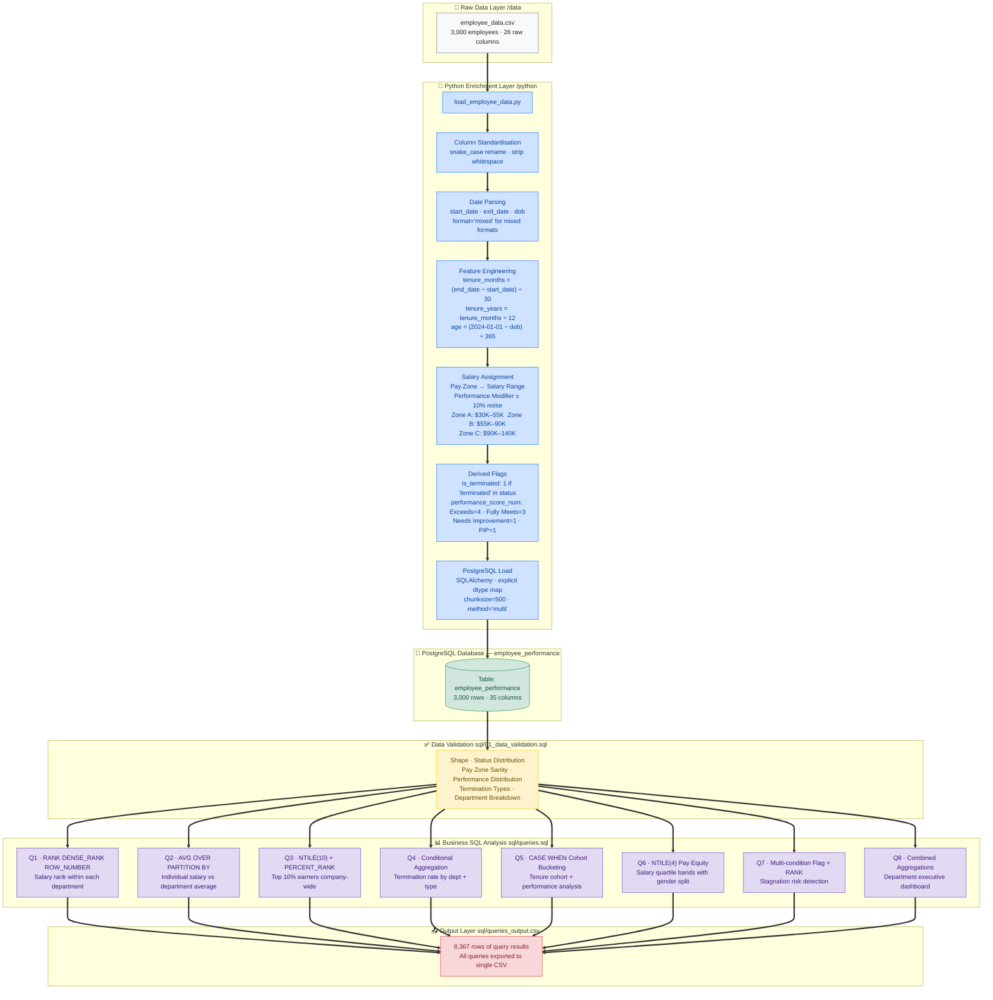

# Employee Performance Dashboard — Synthetic HR Dataset (PostgreSQL)

## Overview

End-to-end SQL analytics project on a 3,000-employee synthetic HR dataset.  
Since the raw dataset contained no salary column, a **Python enrichment pipeline**
was built first to engineer monthly salaries from Pay Zones using a
performance-weighted random assignment model. The enriched dataset was then
loaded into PostgreSQL for 8 business-focused SQL analyses covering compensation
benchmarking, termination patterns, tenure cohort analysis, stagnation risk
detection, and pay equity.

---

## Data Flow Architecture



---

## Tech Stack

| Tool | Purpose |
|---|---|
| **Python 3** | Data enrichment + PostgreSQL load |
| **Pandas** | CSV read, column rename, date parsing |
| **NumPy** | Random salary assignment with controlled seed |
| **SQLAlchemy + psycopg2** | PostgreSQL connection + dtype-controlled table creation |
| **PostgreSQL** | All business SQL analysis |
| **DBeaver** | SQL client for query execution |

---

## Dataset

| Detail | Info |
|---|---|
| Source | Synthetic Employee Records Dataset — Kaggle |
| File | `employee_data.csv` |
| Raw rows | 3,000 employees |
| Raw columns | 26 |
| Final columns after enrichment | 35 |
| Reference date for tenure/age | 2024-01-01 |

### Employee Status Breakdown (post-load)

| Status | Count |
|---|---|
| Active | 2,458 |
| Leave of Absence | 86 |
| Future Start | 69 |
| Voluntarily Terminated | 321 |
| Terminated for Cause | 66 |

### Pay Zone Distribution (with engineered salary)

| Pay Zone | Headcount | Min Salary | Avg Salary | Max Salary |
|---|---|---|---|---|
| Zone A | 1,062 | $33,850 | $42,954 | $51,250 |
| Zone B | 985 | $60,400 | $73,014 | $84,700 |
| Zone C | 953 | $97,850 | $115,741 | $132,250 |

### Performance Distribution

| Score | Count | % |
|---|---|---|
| Fully Meets | 2,361 | 78.7% |
| Exceeds | 369 | 12.3% |
| Needs Improvement | 177 | 5.9% |
| PIP | 93 | 3.1% |

---

## Python Enrichment Details

### Salary Assignment Model

```
Zone A → $30,000 – $55,000
Zone B → $55,000 – $90,000
Zone C → $90,000 – $140,000

Performance modifier on top of zone range:
  Exceeds          → upper 75th percentile of zone
  Fully Meets      → mid 50th percentile of zone
  Needs Improvement → lower 25th percentile of zone
  ± 10% uniform noise added → rounded to nearest $50
  np.random.seed(42) for reproducibility
```

### Key Data Issues Handled

| Issue | Resolution |
|---|---|
| `ExitDate` blank for active employees | Filled with reference date `2024-01-01` for tenure calc |
| Mixed date formats in StartDate/ExitDate | `pd.to_datetime(..., format='mixed')` |
| `EmployeeStatus` had 2 terminated variants | `'terminated' in str(x).lower()` instead of exact match |
| Department names had trailing whitespace | Handled at query level with `TRIM()` where needed |
| No salary column in raw data | Engineered from Pay Zone + Performance — documented above |

---

## Business SQL Analysis — Queries & Findings

### Query 1 — Salary Ranking Within Each Department
**Concepts:** `RANK()`, `DENSE_RANK()`, `ROW_NUMBER()`, `COUNT() OVER(PARTITION BY)`  
**File:** `sql/queries.sql`

Ranked all active employees by salary within their department. All three ranking
functions applied together to demonstrate their difference in tie-handling.

| Function | Tie Behaviour | Example |
|---|---|---|
| `RANK()` | Skips numbers after tie | 1, 1, 3, 4 |
| `DENSE_RANK()` | No gap after tie | 1, 1, 2, 3 |
| `ROW_NUMBER()` | Always unique | 1, 2, 3, 4 |

**Sample — Admin Offices top earners:**

| Employee | Title | Pay Zone | Monthly Salary | Rank |
|---|---|---|---|---|
| Mollie Jenkins | Accountant I | Zone C | $131,650 | 1 |
| Jacey Braun | Accountant I | Zone C | $129,900 | 2 |
| Beatrice Bean | Sr. Accountant | Zone C | $128,050 | 3 |

---

### Query 2 — Individual Salary vs Department Average
**Concepts:** `AVG() OVER(PARTITION BY)`, `MAX/MIN OVER()`, `CASE WHEN` categorisation  

Calculated each active employee's salary deviation from their department average.
Labelled each employee as Significantly Above / Above / Below / Significantly Below.

**Definition:** Significantly Above = more than 20% above dept average

---

### Query 3 — Top 10% Earners Company-Wide
**Concepts:** `NTILE(10)`, `PERCENT_RANK()`  

Divided all active employees into 10 income deciles. `income_decile = 1` → Top 10%.
`PERCENT_RANK()` shows what proportion of the workforce each employee out-earns.

---

### Query 4 — Termination Analysis by Department and Type
**Concepts:** Conditional aggregation, `SUM() OVER()` for percentage of total  

The dataset has 5 termination type values: Voluntary, Involuntary, Retirement,
Resignation, and Unk. Filtered to actual termination statuses only.

**Key findings:**

| Department | Termination Type | Count | Avg Tenure at Exit | Avg Age |
|---|---|---|---|---|
| Production | Voluntary | 78 | 1.42 yrs | 49.1 |
| Production | Involuntary | 75 | 1.46 yrs | 49.8 |
| Production | Retirement | 68 | 1.34 yrs | 52.9 |
| Production | Resignation | 66 | 1.45 yrs | 54.7 |
| IT/IS | Resignation (for cause) | 11 | 1.14 yrs | 48.9 |

**Insight:** Production dominates all termination categories (67%+ of all exits).
Average tenure at exit is consistently low (1.0–1.9 years) — early attrition is
the primary risk, not long-tenured departures.

---

### Query 5 — Tenure Cohort Analysis
**Concepts:** `CASE WHEN` bucketing, `MODE() WITHIN GROUP`, conditional aggregation  

Grouped all employees into tenure bands and measured termination rate,
average salary, and average performance per cohort.

| Tenure Group | Employees | Terminated | Termination Rate | Avg Monthly Salary | Avg Age |
|---|---|---|---|---|---|
| < 1 year | 959 | 187 | **19.50%** | $75,611 | 51.6 |
| 1–2 years | 696 | 98 | 14.08% | $75,978 | 52.3 |
| 2–3 years | 516 | 57 | 11.05% | $76,903 | 51.3 |
| 3–4 years | 390 | 30 | 7.69% | $74,901 | 52.0 |
| 4–5 years | 326 | 15 | 4.60% | $77,945 | 52.5 |
| 5+ years | 113 | 0 | **0%** | $72,058 | 50.1 |

**Key insight:** Termination risk drops sharply with each year of tenure. Employees
who survive past 5 years have 0% termination rate in this dataset — strong indicator
that early-tenure engagement programmes would have the highest ROI.

---

### Query 6 — Salary Quartile Band Analysis (Pay Equity)
**Concepts:** `NTILE(4)`, gender split within bands  

Divided each department's active employees into 4 salary quartiles and analysed
gender composition of each band.

**Sample — Production Department:**

| Band | Count | Floor | Ceiling | Avg | Male | Female |
|---|---|---|---|---|---|---|
| Q1 — Bottom 25% | 425 | $33,950 | $44,100 | $41,645 | 158 | 267 |
| Q2 — Lower Mid | 425 | $44,150 | $72,300 | $60,588 | 162 | 263 |
| Q3 — Upper Mid | 424 | $72,300 | $111,650 | $85,139 | 151 | 273 |
| Q4 — Top 25% | 424 | $111,650 | $132,250 | $118,188 | 168 | 256 |

**Observation:** Female employees are present across all quartiles in Production,
suggesting no strong gender salary skew in the bottom half — a notable finding for
an equity analysis.

---

### Query 7 — Stagnation Risk Detection
**Concepts:** `CASE WHEN` for expected vs actual pay zone, `RANK() OVER(PARTITION BY)`,
multi-condition retention risk labelling  

Compared each active employee's actual Pay Zone against a tenure-based expected Pay Zone.
Employees whose actual zone lags behind expectation are flagged as stagnant.

**Expected zone benchmark used:**

| Tenure | Expected Zone |
|---|---|
| < 2 years | Zone A |
| 2–5 years | Zone B |
| 5–10 years | Zone C |
| 10+ years | Zone D |

**Sample high-risk employees identified:**

| Employee | Department | Title | Actual Zone | Expected Zone | Tenure | Monthly Salary | Risk |
|---|---|---|---|---|---|---|---|
| George Sheppard | Admin Offices | Senior BI Developer | Zone A | Zone C | 5.4 yrs | $44,350 | High Risk |
| Lena Sandoval | Executive Office | Network Engineer | Zone B | Zone C | 5.4 yrs | $69,600 | High Risk |
| Andreas Torres | IT/IS | CIO | Zone A | Zone C | 5.4 yrs | $42,800 | High Risk |

**Key insight:** Several senior-titled employees (CIO, Senior BI Developer, President & CEO)
are in Zone A despite 5+ year tenure — a critical pay equity gap that HR would need to
investigate immediately.

---

### Query 8 — Department Executive Dashboard
**Concepts:** All aggregation types combined into a single executive-level summary  

| Department | Total | Active | Terminated | Term Rate | Avg Salary | Avg Tenure | Avg Perf Score |
|---|---|---|---|---|---|---|---|
| Production | 2,020 | 1,698 | 322 | **15.94%** | $76,056 | 2.1 yrs | 2.94 |
| Software Engineering | 115 | 95 | 20 | **17.39%** | $78,120 | 1.8 yrs | 3.00 |
| IT/IS | 430 | 396 | 34 | 7.91% | $75,720 | 2.1 yrs | 2.90 |
| Sales | 331 | 321 | 10 | 3.02% | $75,658 | 2.1 yrs | 2.97 |
| Admin Offices | 80 | 79 | 1 | 1.25% | $73,146 | 1.9 yrs | 3.09 |
| Executive Office | 24 | 24 | 0 | 0.00% | $73,579 | 1.9 yrs | 2.54 |

**Key insights:**
- Software Engineering has the highest termination rate (17.39%) despite the
  highest average salary ($78,120) — compensation alone is not retaining this group
- Admin Offices has the best average performance score (3.09) with near-zero attrition
- Average tenure across all departments is under 2.5 years — the organisation has a
  systemic early-tenure retention problem

---

## Key Findings Summary

1. **Early tenure is the #1 attrition risk** — 19.5% of employees with less than 1
   year leave; employees past 5 years have 0% termination rate
2. **Production drives 67%+ of all terminations** — by volume this is the department
   most in need of a retention programme
3. **Software Engineering is the highest-risk department by rate (17.39%)** —
   despite above-average pay, this group exits earliest (avg tenure 1.8 years)
4. **Stagnation risk is widespread** — multiple employees with 5+ year tenure and
   senior titles (CIO, Senior BI Developer) remain in Zone A, a critical underpayment
   gap that drives voluntary exits
5. **Pay equity is reasonably distributed by gender** in Production — female employees
   appear across all 4 salary quartiles without strong clustering at the bottom

---

## SQL Concepts Demonstrated

| Concept | Query | Detail |
|---|---|---|
| `RANK()` | Q1 | Salary rank within department — skips on ties |
| `DENSE_RANK()` | Q1 | Same but no gap after ties |
| `ROW_NUMBER()` | Q1 | Always unique sequential number |
| `COUNT() OVER(PARTITION BY)` | Q1 | Department headcount alongside each row |
| `AVG() OVER(PARTITION BY)` | Q2 | Running dept average without GROUP BY |
| `NTILE(10)` | Q3 | Divide into 10 equal buckets — top decile = top 10% |
| `PERCENT_RANK()` | Q3 | Relative position of each employee 0–1 |
| `NTILE(4)` | Q6 | Salary quartile bands for pay equity analysis |
| `MODE() WITHIN GROUP` | Q5 | Most frequent value — most common performance label |
| `SUM() OVER()` | Q4 | Grand total for % of all terminations |
| CTE (`WITH`) | Q2, Q3, Q5, Q7 | Multi-step logic — clean and readable |
| `CASE WHEN` (multi-rule) | Q7 | Expected vs actual pay zone comparison |
| Conditional aggregation | Q4, Q8 | `COUNT(CASE WHEN ... THEN 1 END)` pattern |

---

## Window Functions Reference Card

```sql
-- Rank within a group
RANK()        OVER (PARTITION BY department ORDER BY salary DESC)
DENSE_RANK()  OVER (PARTITION BY department ORDER BY salary DESC)
ROW_NUMBER()  OVER (PARTITION BY department ORDER BY salary DESC)

-- Group statistics alongside each row (no GROUP BY needed)
AVG(salary)   OVER (PARTITION BY department)
MAX(salary)   OVER (PARTITION BY department)
COUNT(*)      OVER (PARTITION BY department)

-- Divide into equal buckets
NTILE(4)      OVER (ORDER BY salary)         -- quartiles
NTILE(10)     OVER (ORDER BY salary)         -- deciles

-- Relative position
PERCENT_RANK() OVER (ORDER BY salary)        -- returns 0.0 to 1.0
```

---

## File Structure

```
Employee Performance Dashboard_HR/
│
├── README.md
│
├── data/
│   └── employee_data.csv               ← raw Kaggle dataset (3,000 rows, 26 cols)
│
├── python/
│   ├── load_employee_data.py           ← enrichment + PostgreSQL load script
│   └── load_employee_data_output.txt   ← console output confirming successful load
│
└── sql/
    ├── 01_data_validation.sql                      ← shape, status, pay zone, dept checks
    ├── data_validation_sql_queries_with_output.txt ← validation results
    ├── queries.sql                                 ← all 8 business queries
    └── queries_output.csv                          ← exported results (8,367 rows)
```

---

## How to Reproduce

```bash
# 1. Clone the repo
git clone https://github.com/SahilGogna/sql-employee-performance-dashboard.git
cd sql-employee-performance-dashboard

# 2. Install dependencies
pip install pandas numpy sqlalchemy psycopg2-binary openpyxl

# 3. Create PostgreSQL database
psql -U postgres -c "CREATE DATABASE employee_performance;"

# 4. Update DB credentials in python/load_employee_data.py
#    DB_USER, DB_PASSWORD, CSV_PATH

# 5. Run the enrichment + load pipeline
python python/load_employee_data.py

# 6. Run validation queries
#    Open sql/01_data_validation.sql in DBeaver and execute

# 7. Run business queries
#    Open sql/queries.sql in DBeaver and execute all 8 queries
```

---

## Other Projects in This Portfolio

| Project | Tools | Link |
|---|---|---|
| Ecommerce Sales Analysis (Google Analytics) | BigQuery SQL | [repo link] |
| Customer Churn Analysis (Telco) | PostgreSQL · Python · Pandas | [repo link] |
| Employee Performance Dashboard | PostgreSQL · Python · Pandas | ← You are here |
| Fraud Detection (coming soon) | PostgreSQL · CTEs · Window Functions | — |
| Olist Brazilian E-commerce | PostgreSQL · Multi-table JOINs | [repo link] |
| Dairy Sales & Finance Analysis | PostgreSQL · Tableau | [repo link] |
